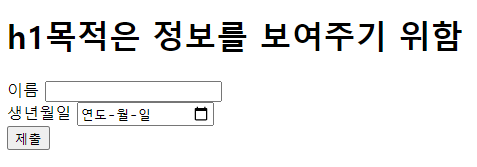
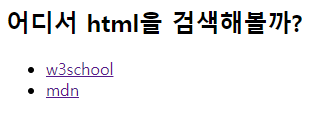

# Today I learned

> html, css


### html

- `code` 를 사용한 `emmet`의 도움으로 기본 틀을 만들 수 있다.

실제로 html과 head, body간 indent가 들어가야하나, 가독성을 위해 같은 indent에 배치하였다. 이는 html의 열고 닫음이 확실하게 정의되어있어 이를 이해할 수 있음을 알려준다.

```html
<!DOCTYPE html>
<html lang="en">
<head>
  <meta charset="UTF-8">
  <meta http-equiv="X-UA-Compatible" content="IE=edge">
  <meta name="viewport" content="width=device-width, initial-scale=1.0">
  <title>Document</title>
</head>
<body>
  
</body>
</html>
```

- head에는 실제 웹상으로 보이는 것이 아닌 메타데이터를 담고있다. 어떻게 인코딩되는지 등의 정보를 담고 있고, 실제로 사용자에게 보여지지 않는다.


`<h1>`같은 제목 글씨는 markdown과 비슷한 성격을 가지는데, 이는 정보를 보여주는 데에 목적이 있다. 이와 반대로 `<form>`은 정보를 사용자로부터 얻어오는데 목적이 있다.

```html
<form action="">
    <div>
      이름 <input type="text">  
    </div>
    <div>
      생년월일 <input type="date">
    </div>
    
    <input type="submit">
  </form>
```



여기서 사용된 `<div>`는 구간을 나누는 역할을 사용하며, 실제로 시멘틱 코드를 사용하여 더 정확하게 역할을 분배할 수 있게 된다.

- 하이퍼 링크 첨부

실제로 하이퍼링크를 첨부하여 클릭으로 다른 웹페이지 상으로 넘어가는 것을 구현할 수 있다. 이는 `<a>` 를 사용하여 `href`로 링크를 연결할 수 있다. 또, ul, li를 사용하여 unordered, ordered 표현 방법을 사용할 수 있다.

```html
<ul>
    <li>
      <a href="https://www.w3schools.com/">w3school</a>
    </li>
    <li>
      <a href="https://developer.mozilla.org/ko/">mdn</a>
    </li>
  </ul>
```



 [00_intro.html](00_intro.html) 로 이를 확인할 수 있다.


### css

- 선택자와 결합자로 분류할 수 있다.

- css 선택자는 스타일을 적용시키기 위한 `html`요소를 선택할 수 있다.

css 구문은 다음과 같다.

```css
선택자 { 속성 : 속성값;}
selector { property : value;}
```

이를 html로 사용한 방법은 다음과 같다.

```html
<style>
    h1{
        color : red;
        ..
    }
    
    .container {
        ..
    }
    #app {
        ...
    }
</style>
```


##### 선택자의 종류

- 유형 선택자(type selector) : 요소 이름

```html
p { color : red;}
```

p 요소가 있는 곳은 모두 빨간 글씨로 지정하겠다는 뜻.


- 전체 선택자(universal selector) : 문서에서 모든 요소에 적용.

```html
* {margin: 0px; padding: 0px;}
```

모든 요소에 지정한다는 뜻.


- ID선택자(id selector) : 구체적 id를 지닌 요소(딱 한개)

```html
#header {text-align: center;}
```

header라는 id를 지닌 곳에 가운데로 정렬하겠다는 의미.


- 클래스 선택자(class selector) : 많은 요소에 스타일을 한꺼번에 지정하고자 할 때 class로 지정된 요소

```html
.popup{ font-size: 11px;}
```

popup이란 이름을 지닌 곳에는 모두 글꼴을 11px로 하겠다는 의미.


- 자식 결합자

```html
div > span { color: red;}
```

div 자식에 존재하는 span만 상속하겠다는 의미.


- 자손 결합자

```html
div span{ color: red;}
```

div 아래 모든 span에 상속하겠다는 의미.


### Box model

```html
.box {
  box-sizing: border-box;
} 
```

