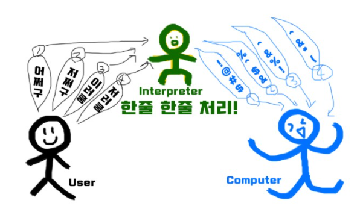
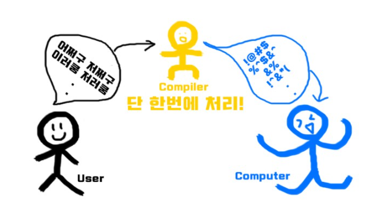

# cs(Python)

Q. 파이썬은 인터프리터 언어입니까?

- A : 통상적으로 인터프리터 언어라고 합니다!

  - Q : 그럼 인터프리터 언어가 뭔데용??

    - A : 코드를 한줄 한줄 읽어가며 명령을 처리하는 프로그램을 인터프리터라고 하는데, 이렇게 해석되는 언어를 인터프리터 언어라고 한다.

    

    출처 : https://blog.naver.com/zosl1004/221242373322

  - Q. 그럼 컴파일 언어는 뭔데용??
    - A : 명령어를 몽~땅 검사하는 애를 컴파일러라고 하고, 이런 형태의 언어를 컴파일 언어라고 한다.

  

  ​	출처 : 동일

  

  - ### 사실은...

  고전적인 의미에서의 컴파일 언어는 '실행시간 이전에 기계어 코드로 번역되는 언어'라고 정의하는데, `Typescript`는 `Javascript`로 해석되어 실행되는 언어이기 때문에 얘도 컴파일 언어라고 해야하는데.. `정의가 좀 이상하다 그쵸?`

  

  또, 인터프리터 언어는 실행 전에 기계어로의 컴파일 과정을 거치지 않고, 소스코드가 해석기를 통해 해석되어 실행되도록 구현하는 언어를 말하는데, 소스코드가 의도하는 작업의 실질적 수행이 이를 해석하는 인터프리터를 통해 수행됩니다. 이 경우에 인터프리터는 일종에 가상머신이나 실행환경 및 에뮬레이터 정도로 이해될 수 있습니다. 그러면, `Java`는 `JVM`에 의해 실행되니깐 `인터프리터 언어`야?

  

  

  

  >신화에 대한 잘못된 질문은 그것이 진실인지 거짓인지를 묻는 것입니다. 올바른 질문은 그것이 살아있느냐 죽느냐 하는 것이고, 그것이 여전히 우리의 상태를 말하는가 하는 것이다.
  >
  >-`Richard Holloway`

  

  ##### 언어의 속성이 아닌 구현체의 디자인

  문제는 컴파일 언어냐 인터프리터 언어냐 하는 것이 언어 자체를 분류하거나 구분짓는 특성이 아니라는 것.


## Generator

---

제너레이터는 제너레이터 함수가 호출될 때 반환되는 iterator의 일종이다. 일반적인 함수와 비슷하게 생겼지만, `yield`구문을 통해 데이터를 원하는 시점에 반환하고 처리를 다시 시작할 수 있다. 일반적인 함수는 진입점이 하나라면, 제너레이터는 진입점이 여러개라고 생각할 수 있다.

```python
>>> def generator():
...     yield 1
...     yield 'string'
...     yield True
>>> gen = generator()
>>> gen
<generator object generator at 0x10a47c678>
>>> next(gen)
1
>>> next(gen)
'string'
>>> next(gen)
True
>>> next(gen)
Traceback (most recent call last):
  File "<stdin>", line 1, in <module>
StopIteration
```


### Call by assignment(object reference)

불변 타입의 객체를 넘기면 `call by value`, 가변 타입의 객체를 넘기면 `call by reference`가 된다. 즉, 할당되는 것에 따라 전달 방식이 달라진다!

- `WHY?`

파이썬에는 모든 것이 객체이기 때문이다. `Mutable`객체를 넘기면 새로운 값을 생성하기 